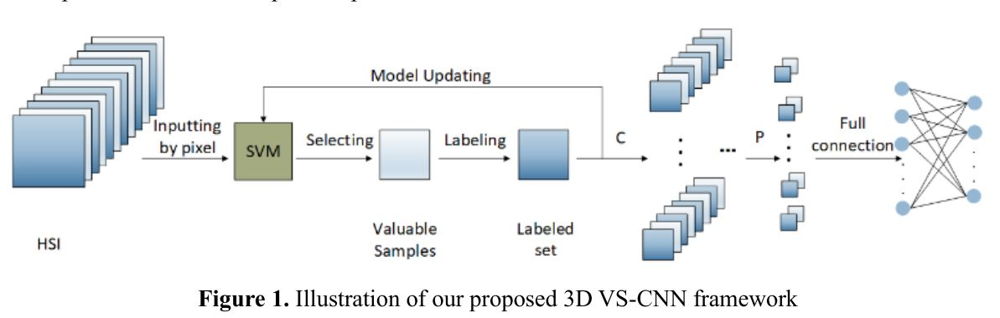
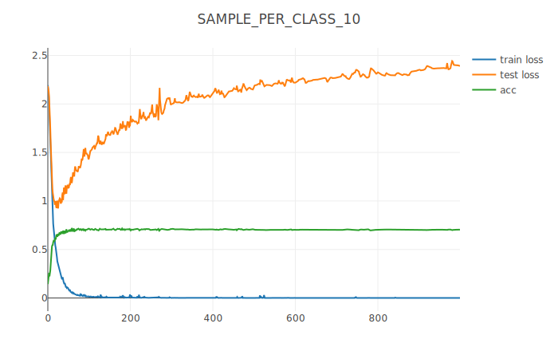
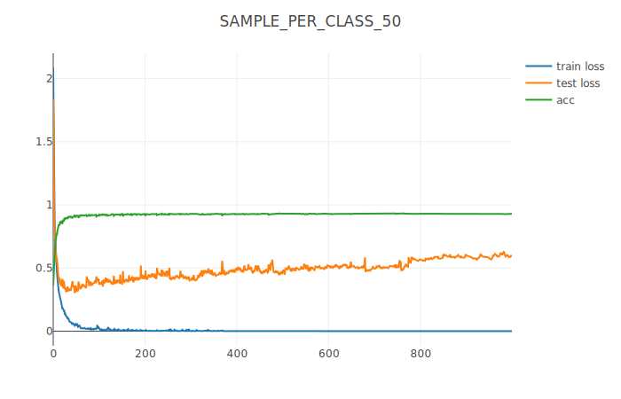
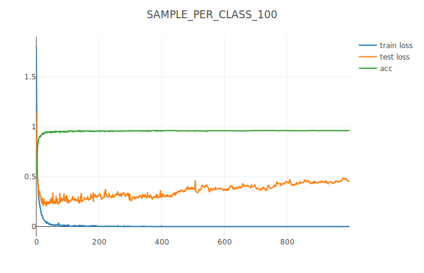
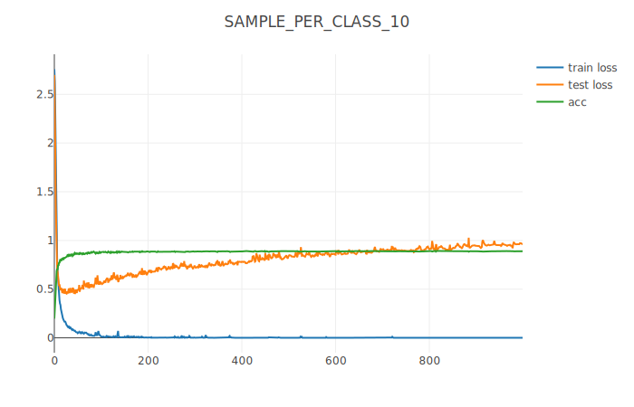
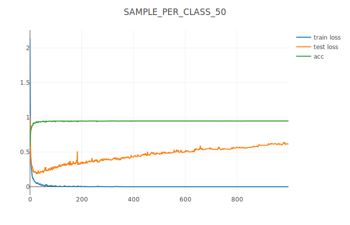
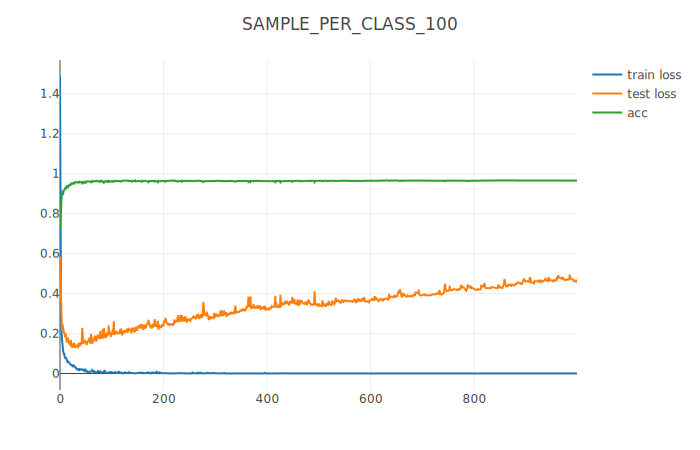
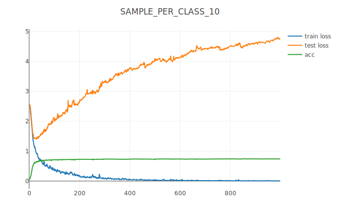
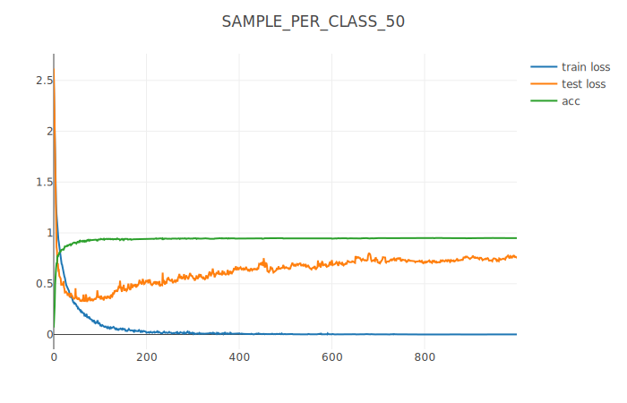
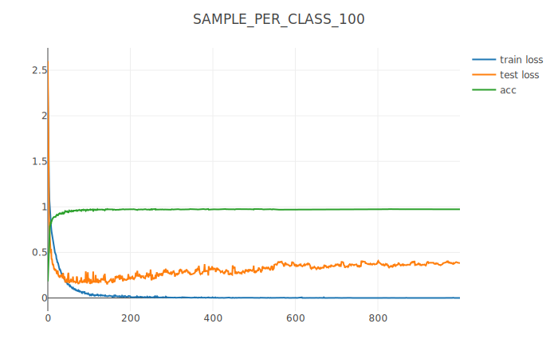

# 3DVSCNN
## Introduction
This is a reproduction of *Hyperspectral Image Classification of Convolutional Neural Network Combined with Valuable Samples*.

## Requirements
* pytorch 1.3
* scikit-learn
* scipy
* visdom
## Experiment
模型分别在PaviaU，Salinas和KSC这三个基准数据集上进行测试。实验总共分为三组，分别为每类样本量为10，每类样本量为50和每类样本量为100。为了减少误差，每组实验分别进行10次，最终的准确率取10次实验的均值。数据预处理阶段，SVM采用迭代采样的方法从训练集中挑选80%的有价值样本作为新的训练集。

在PaviaU数据集上的准确率（%）如下表所示：

<table>
<tr align="center">
<td colspan="6">PaviaU</td>
</tr>
<tr align="center">
<td colspan="2">10</td>
<td colspan="2">50</td>
<td colspan="2">100</td>
</tr>
<tr align="center">
<td>mean</td>
<td>std</td>
<td>mean</td>
<td>std</td>
<td>mean</td>
<td>std</td>
</tr>
<tr align="center">
<td>75.17</td>
<td>4.24</td>
<td>90.69</td>
<td>0.71</td>
<td>94.76</td>
<td>0.45</td>
</tr>
</table>

学习曲线如下所示：

在Salinas数据集上的准确率（%）如下表所示：

<table>
<tr align="center">
<td colspan="6">Salinas</td>
</tr>
<tr align="center">
<td colspan="2">10</td>
<td colspan="2">50</td>
<td colspan="2">100</td>
</tr>
<tr align="center">
<td>mean</td>
<td>std</td>
<td>mean</td>
<td>std</td>
<td>mean</td>
<td>std</td>
</tr>
<tr align="center">
<td>77.54</td>
<td>1.24</td>
<td>87.01</td>
<td>0.97</td>
<td>90.25</td>
<td>0.45</td>
</tr>
</table>

学习曲线如下所示：

在KSC数据集上的准确率（%）如下表所示：

<table>
<tr align="center">
<td colspan="6">KSC</td>
</tr>
<tr align="center">
<td colspan="2">10</td>
<td colspan="2">50</td>
<td colspan="2">100</td>
</tr>
<tr align="center">
<td>mean</td>
<td>std</td>
<td>mean</td>
<td>std</td>
<td>mean</td>
<td>std</td>
</tr>
<tr align="center">
<td>77.40</td>
<td>2.86</td>
<td>96.03</td>
<td>0.63</td>
<td>98.55</td>
<td>0.55</td>
</tr>
</table>

学习曲线如下所示：

## Runing the code
